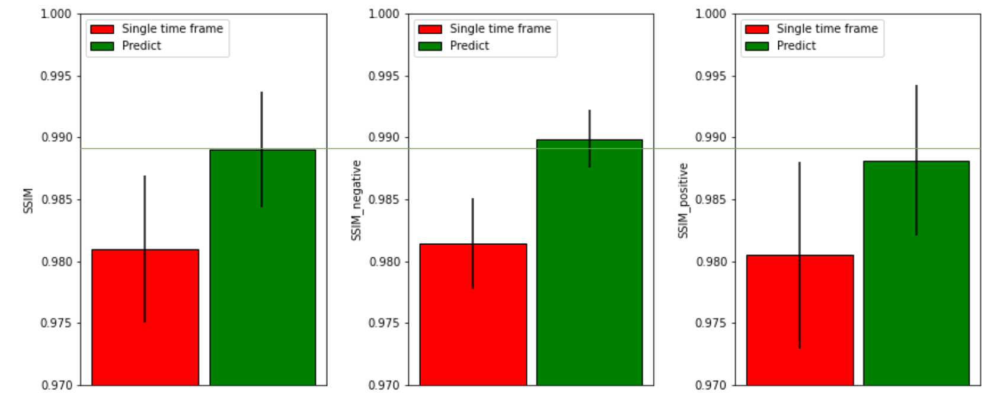
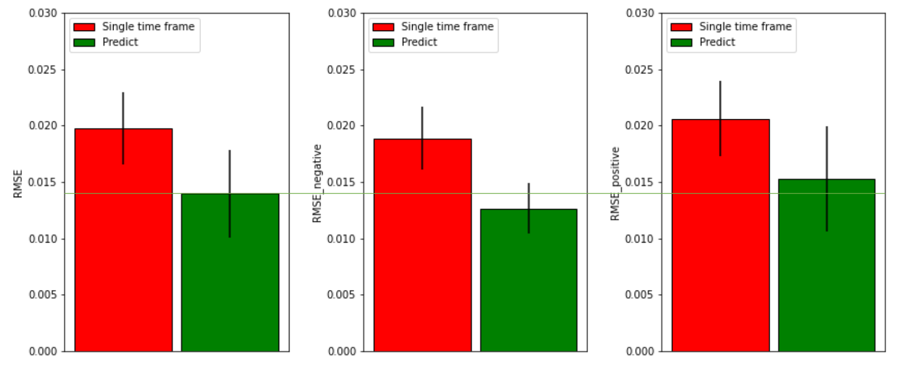
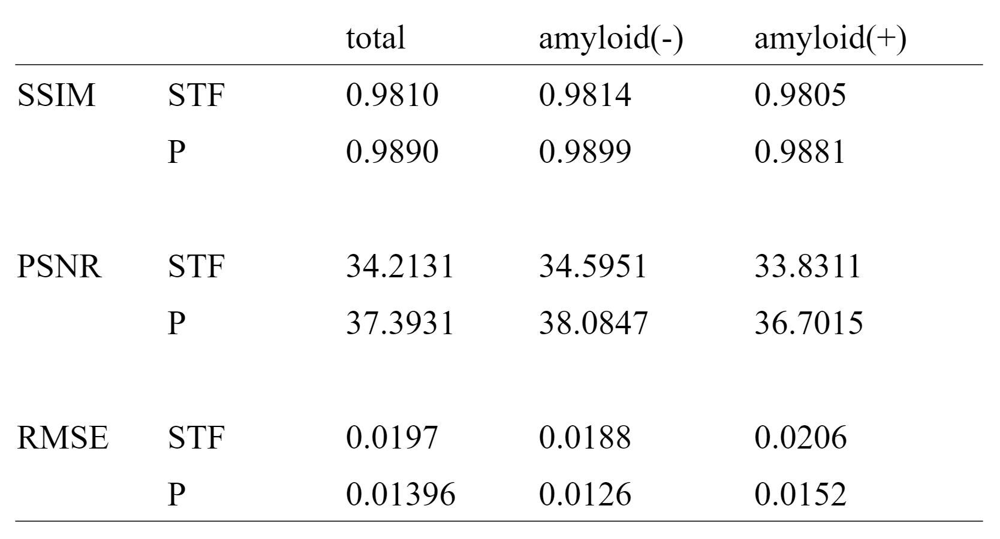

# NCU graduation project - Synthesis late phase Amyloid PET Image with Under-sampled Data

**Abstract:**

We apply U-net to synthesize 20 minutes late phase amyloid PET image using 5 minutes image. 

**U-net modification:**
* 3D layers for 3D input and output
* Added some batch normalization layers for faster convergence

**Conclution:**

Judging from PSNR, SSIM and RMSE, the image quality has indeed improved.


## Resources

* [U-Net: Convolutional Networks for Biomedical Image Segmentation](https://arxiv.org/abs/1505.04597)
* [Ultra–Low-Dose 18F-Florbetaben Amyloid PET Imaging Using Deep Learning with Multi-Contrast MRI Inputs](https://pubs.rsna.org/doi/full/10.1148/radiol.2018180940)
* [OASIS3 AV45_PET](https://www.oasis-brains.org/)

## Set up

Here are some set up recommendation.

### Anaconda

By the time we finished this project, we're using [Anaconda](https://www.anaconda.com/products/individual) 2019.07. It's not required to download this specific version. Newer version should work just fine.  

### Python requirements

Download these first:  

* [Microsoft Visual Studio](https://visualstudio.microsoft.com/vs/community/)  
* [CUDA 11.0](https://developer.nvidia.com/cuda-11.0-download-archive)  
* [cuDNN 8.0](https://developer.nvidia.com/cudnn)  
* [Graphviz](https://graphviz.gitlab.io/download/)  

Next, please open anaconda prompt, create a clean environment and install library dependencies:

```
conda create -n tf2.4 python=3.8
activate tf2.4
pip install -r requirements.txt
conda install pydot
```

## Preparing the PET training dataset

**Step #1:** After acquiring authorization from [OASIS](https://www.oasis-brains.org/), please download all OASIS3-AV45-PET-.nii data.

**Step #2:** Convert OASIS3 dataset into .tfrecord:  

There are two data folder structures we accept:  

```
data/
  folder1/folder2/folder3/.../folderN/sub-OAS30001_ses-d2430_acq-AV45_pet.nii.gz
  folder1/folder2/folder3/.../folderN/sub-OAS30002_ses-d2340_acq-AV45_pet.nii.gz
  folder1/folder2/folder3/.../folderN/sub-OAS30003_ses-d2682_acq-AV45_pet.nii.gz
  ...

or

data/
  sub-OAS30001_ses-d2430_acq-AV45_pet.nii.gz
  sub-OAS30002_ses-d2340_acq-AV45_pet.nii.gz
  sub-OAS30003_ses-d2682_acq-AV45_pet.nii.gz
  ...
```

Start preprocessing:

```
python preprocess.py --data-dir=<put your data folder path here!>
```

For example, if you named your training data folder "data" and it's in the same folder as preprocess.py. Then:

```
python preprocess.py --data-dir=data
```

## Training

```
python main.py --mode=train --epoch=<put the number of epochs you want to train here! (recommend=30~)>
```

To inspect training loss, please use tensorboard:

```
tensorboard --logdir=logs
```

## Generating output

```
python main.py --mode=predict --epoch=<put the number of epoch you want to use here!>
```

* PNG image outputs from left to right: input/prediction/ground truth.
* NIFTI image outputs have already specified whether it's input, prediction or ground truth at the end of their file name.

## Results





