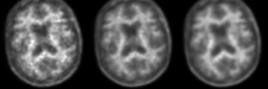
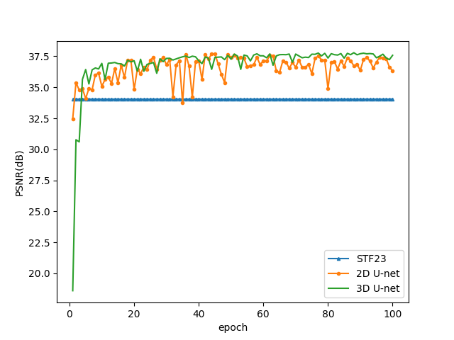
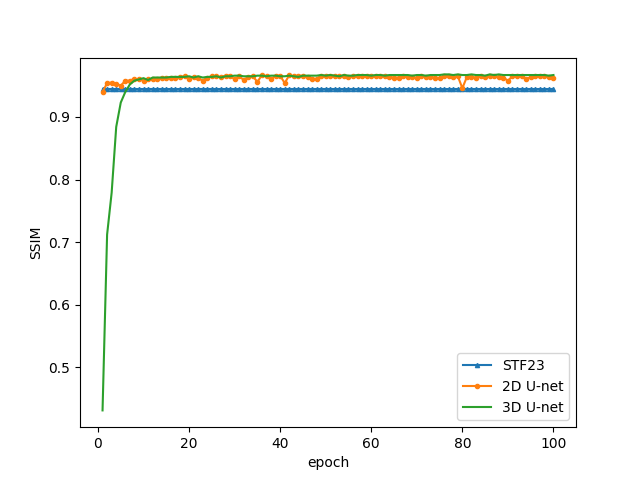
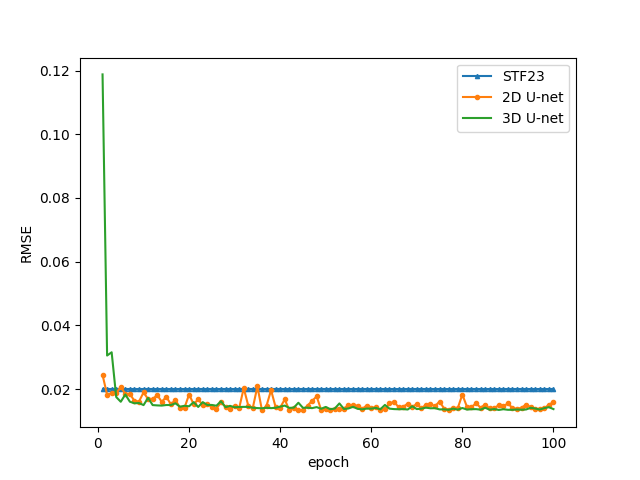

# NCU graduation project - Denoising Of Amyloid PET Images Using U-net With L1-loss

**Abstract:**

We used U-net to synthesize amyloid PET's 20 minutes measurement with 5 minutes measurement. 
Besides 2D kernel, we also tried 3D kernel for U-net since we're dealing with 3D volume data.

**Conclution:**

Judging from PSNR, SSIM and RMSE, the image quality has indeed improved.
Using 2D or 3D kernels didn't dramatically effect these three metrics.
To some extent, synthesis of PET with long measurement with short measurement is feasible.

Result from U-net with 3D kernel:  
(input/target/prediction)  



## Resources

* [U-Net: Convolutional Networks for Biomedical Image Segmentation](https://arxiv.org/abs/1505.04597)
* [Ultra–Low-Dose 18F-Florbetaben Amyloid PET Imaging Using Deep Learning with Multi-Contrast MRI Inputs](https://pubs.rsna.org/doi/full/10.1148/radiol.2018180940)
* [OASIS3 AV45_PET](https://www.oasis-brains.org/)

## Set up

Here are some set up recommendation.

### Anaconda

By the time we finished this project, we're using [Anaconda](https://www.anaconda.com/products/individual) 2019.07. It's not required to download this specific version. Newer version should work just fine.  

### Python requirements

Download these first:  

* [Microsoft Visual Studio](https://visualstudio.microsoft.com/vs/community/)  
* [CUDA 11.0](https://developer.nvidia.com/cuda-11.0-download-archive)  
* [cuDNN 8.0](https://developer.nvidia.com/cudnn)  

Next, please open anaconda prompt, create a clean environment and install library dependencies:

```
conda create -n tf2.4 python=3.8
activate tf2.4
pip install -r requirements.txt
conda install pydot
```

## Preparing the PET training dataset

**Step #1:** After acquiring authorization from [OASIS](https://www.oasis-brains.org/), please download all OASIS3-AV45-PET-.nii data.

**Step #2:** Convert OASIS3 dataset into .tfrecord:  

There are two data folder structures we accept:  

```
data/
  folder1/folder2/folder3/.../folderN/sub-OAS30001_ses-d2430_acq-AV45_pet.nii.gz
  folder1/folder2/folder3/.../folderN/sub-OAS30002_ses-d2340_acq-AV45_pet.nii.gz
  folder1/folder2/folder3/.../folderN/sub-OAS30003_ses-d2682_acq-AV45_pet.nii.gz
  ...

or

data/
  sub-OAS30001_ses-d2430_acq-AV45_pet.nii.gz
  sub-OAS30002_ses-d2340_acq-AV45_pet.nii.gz
  sub-OAS30003_ses-d2682_acq-AV45_pet.nii.gz
  ...
```

Start preprocessing:

```
python preprocess.py --data-dir=<put your data folder path here!>
```

For example, if you named your training data folder "data" and it's in the same folder as preprocess.py. Then:

```
python preprocess.py --data-dir=data
```

## Training

2D U-net:
```
python main.py --mode=train --model=2d --epoch=100
```

3D U-net:
```
python main.py --mode=train --model=3d --epoch=100
```

To inspect training loss, please use tensorboard:

```
tensorboard --logdir=logs
```

## Generating output

For example, generating results from 3D U-net's 100th epoch:
```
python main.py --mode=predict --model=3d --epoch=100
```

* PNG image outputs from left to right: input/ground truth/prediction

Some python script used for evaluation:
```
python eval.py
python plot.py
```

## Results




