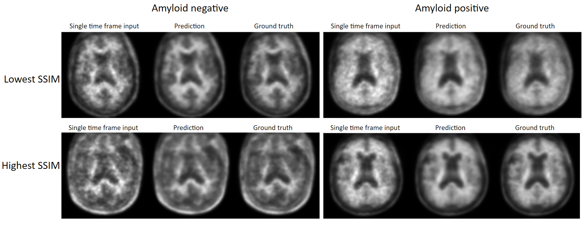

# NCU graduation project - Synthesis late phase Amyloid PET Image with Under-sampled Data

**Abstract:**

We apply U-net to synthesize 20 minutes late phase amyloid PET image using 5 minutes image.  
U-net modification: 
* 3D layers for 3D input and output
* Added some batch normalization layers for faster convergence

**Conclution:**

Judging from PSNR, SSIM and RMSE, the image quality has indeed improved.



## Resources

* [U-Net: Convolutional Networks for Biomedical Image Segmentation](https://arxiv.org/abs/1505.04597)
* [Ultra–Low-Dose 18F-Florbetaben Amyloid PET Imaging Using Deep Learning with Multi-Contrast MRI Inputs](https://pubs.rsna.org/doi/full/10.1148/radiol.2018180940)
* [OASIS3 AV45_PET](https://www.oasis-brains.org/)

## Set up

Here are some set up recommendation.

### Anaconda

By the time we finish this project, we're using Anaconda 2019.07. It's not required to download this specific version. Newr version should work just fine.  

### Python requirements

After downloading Anaconda, please create a clean environment and install library dependencies:

```
conda create -n tf2.4 python=3.8
activate tf2.4
pip install tensorflow==2.4.0
pip install tensorflow_gpu==2.4.0
pip install matplotlib
pip install scipy
conda install pydot
```

Next, please download pydot from [Graphviz](https://graphviz.gitlab.io/download/) for model visualization.

We used data from [OASIS3](https://www.oasis-brains.org/). After acquiring authorization from OASIS, please download all AV45-PET-.nii data.

## Preparing the PET training dataset

**Step #1:** After acquiring authorization from [OASIS](https://www.oasis-brains.org/), please download all OASIS3-AV45-PET-.nii data.

**Step #2:** Convert OASIS3 dataset into .tfrecord:
```
python preprocess.py --data-dir=<put your data path here!>
```

For example, if your data folder named "data" and it's in the same folder as preprocess.py. Then:

```
python preprocess.py --data-dir=data
```

## Training

```
python main.py --mode=train --epoch=<put the number of epochs you want to train here! (recommend=20~)>
```

## Generating output

```
python main.py --mode=predict --epoch=<put the number of epoch you want to use here!>
```
